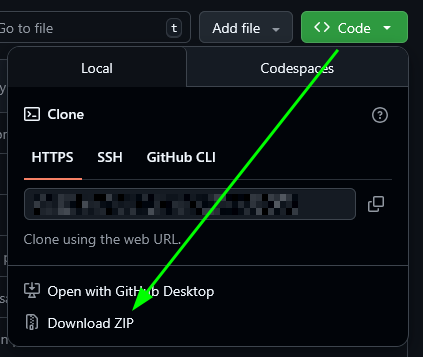
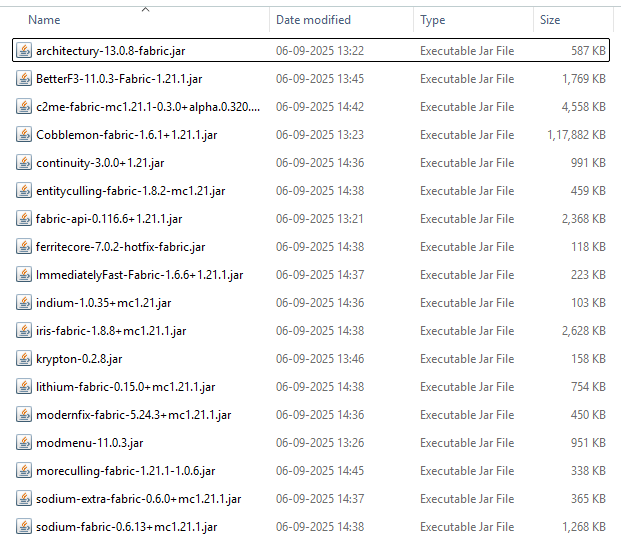

# Cobblemon Setup - Minecraft

# Please actually read this entire file like a literate person and practice some critical thinking. Thank you.
Minecraft setup for the [Cobblemon mod](https://modrinth.com/mod/cobblemon). If you don't have a launcher, I've posted a link for one on Discord.

# Minecraft setup

1. Download Minecraft ***1.21.1 Fabric*** (***not*** vanilla, or any other version). I've included this in the discord message as well.

# Install Mods

1. Download as a ZIP and then unzip

2. Drag all the mods in `mods/` folder to your Minecraft mods folder, usually located at
    `C:\Users\name\AppData\Roaming\.minecraft\mods`

    Your `.minecraft/mods/` folder should look like this:

3. Download Cobblemon mod separately, GitHub enforces a limit of 100MB per file, so cannot push it here\
https://modrinth.com/mod/cobblemon/versions?g=1.21.1&l=fabric \
This link should directly open the correct version; v1.21.1 and Fabric mod loader. ***Put the downloaded .jar file into your minecraft mods folder.***

# Post Install Check

1. Start the game, it should start normally without crashing.

2. To test if the mod works, create a new single player world with Creative mode and cheats enabled. Pressing `M` should open the starter pokemon selection menu. Commands like `/spawnpokemon`, `/spawnallpokemon` should be available (unless you forgot to enable cheats on world creation).

3. Change keybinds in `Options > Controls > Keybinds` menu. Video settings are in `Options > Video Settings`, you can adjust resolution, set full screen, etc.

4. Connect to the server, IP is in the discord message. If you cannot connect on the first try, retry a few times.

# Mods list

## Mandatory
- architectury
- Cobblemon
- fabric-api

## Performance (Recommended)
- c2me
- entityculling
- ferritecore
- ImmediatelyFast
- indium
- krypton
- lithium
- modernfix
- moreculling
- sodium-extra
- sodium

## Miscellaneous QoL
- BetterF3
- continuity
- modmenu
