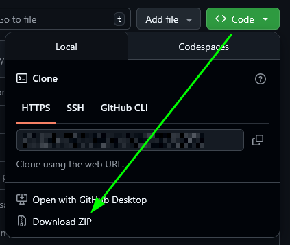

# Cobblemon Setup - Minecraft

# Read the entire file once, and then start following the steps
Minecraft setup for the [Cobblemon mod](https://modrinth.com/mod/cobblemon). If you don't have a launcher, I've posted a link for one on Discord.

# Minecraft setup

1. Download Minecraft ***1.21.1 Fabric*** (***not*** vanilla, or any other version). I've included this in the discord message as well.
2. If you don't wanna use launcher in the discord message, look up how to setup Fabric for `1.21.1`, its a straightforward process.

# Install Mods

1. Download as a ZIP and then unzip.

### Ignore the `images/` folder.

2. Drag all the mods in this downloaded `mods/` folder to your Minecraft mods folder, usually located at
    `C:/Users/name/AppData/Roaming/.minecraft/mods`

3. Download latest version (v1.6.1) of Cobblemon mod separately, GitHub enforces a limit of 100MB per file, so cannot push it here\
https://modrinth.com/mod/cobblemon/versions?g=1.21.1&l=fabric \
This link should directly open the correct version; v1.21.1 and Fabric mod loader. ***Put the downloaded .jar file into your minecraft mods folder.*** 

The list of mods included are in a later section of this document.

# Install Resource Packs

1. Drag and drop all `.zip` files in the downloaded `resourcepacks/` folder, to the `.minecraft/resourcepacks/` folder (your game folder).

2. DO NOT UNZIP THESE FILES, keep them a zip.

3. After loading into the game, open the Resource Packs screen from the Options menu. You should see the resource packs on the left side, click on their icons to move them to the right to enable them, and exit the screen.

# Post Install Check

### Reminder to download Cobblemon as well.
### Reminder to download and move resource pack as well.
1. Start the game, it should start normally without crashing.

2. To test if the mod works, either try joining the server, or create a new single player world with Creative mode and cheats enabled. Pressing `M` should open the starter pokemon selection menu. Commands like `/spawnpokemon`, `/spawnallpokemon` should be available (unless you forgot to enable cheats on world creation).

3. Change keybinds in `Options > Controls > Keybinds` menu. Video settings are in `Options > Video Settings`, you can adjust resolution, set full screen, etc.

4. Connect to the server, IP is in the discord message. If you cannot connect on the first try, retry a few times.

# Mods list

## Mandatory
- architectury
- athena
- chipped
- Cobblemon
- CobbleDollars
- CobbleFurnies
- cobblemon_knowlogy
- Cobblemon_MegaShowdown
- cobblemonriding
- cobblenav
- entity_model_features
- entity_texture_features
- fabric-api
- gachamachine
- geckolib
- LegendaryMonuments
- MoreCobblemonTweaks
- resourcefullib
- ScalableLux
- SimpleTMs
- sophisticatedbackpacks
- tsfitemcore

## Performance (Recommended)
- c2me
- entityculling
- ferritecore
- ImmediatelyFast
- indium
- krypton
- lithium
- modernfix
- moreculling
- sodium-extra
- sodium

## QoL
- BetterF3
- continuity
- modmenu
- polytone
- Xaeros_Minimap

# Resource Packs list

## Mandatory
- CobbledGacha
- MysticMons (disable this if pokemon like Dialga, Palkia, Giratina, etc have missing textures)

## QoL
- Fullbright-UB
